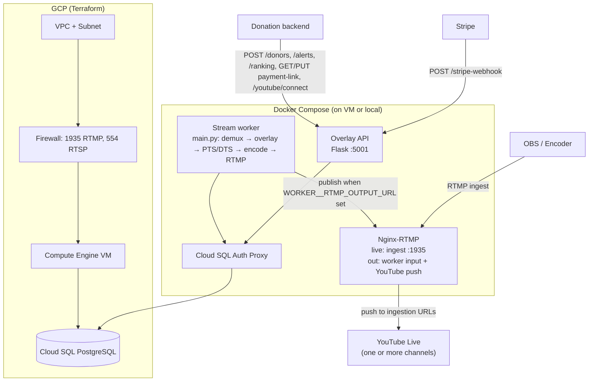
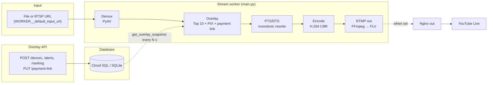
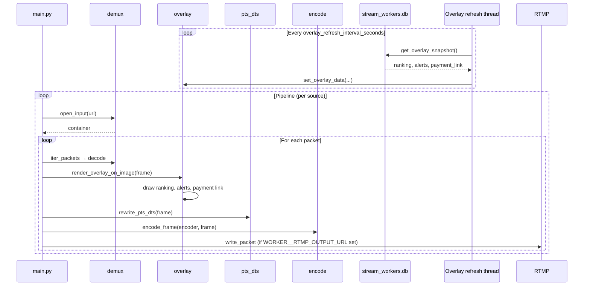
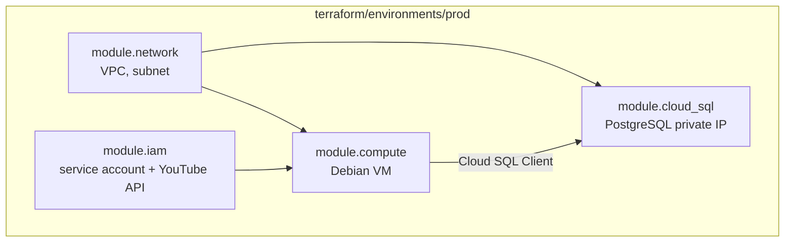

# Donatik Tube – 24/7 streaming on GCP

Live streaming pipeline for **YouTube Live**: Terraform-provisioned GCP infrastructure (Compute Engine, Cloud SQL PostgreSQL), Nginx-RTMP ingest, and Python workers for demux, overlay (Top 10 donor ranking, PIX alerts, and a **payment/donation link**), PTS/DTS continuity, and H.264 encode. The worker publishes the encoded stream via FFmpeg to an RTMP URL when configured; the **overlay API** obtains ingestion URLs from the YouTube API and writes Nginx push config so the same stream goes to **multiple YouTube channels** (no manual stream keys). The overlay API also exposes **payment link** endpoints (GET/PUT), **YouTube OAuth** (/youtube/connect, /youtube/callback), and an optional **Stripe webhook** for payment-to-donor sync.

This guide explains how the system works and how to deploy it on Google Cloud Platform.

---

## Table of contents

1. [How it works (diagrams)](#how-it-works-diagrams)
2. [Project structure](#project-structure)
3. [Prerequisites](#prerequisites)
4. [GCP project setup](#gcp-project-setup)
5. [Deploy infrastructure with Terraform](#deploy-infrastructure-with-terraform)
6. [Cloud SQL: create user and get connection details](#cloud-sql-create-user-and-get-connection-details)
7. [Configuration and secrets](#configuration-and-secrets)
8. [Initialize the database](#initialize-the-database)
9. [Run the stack (Docker Compose)](#run-the-stack-docker-compose)
10. [Ingest stream and push to YouTube Live](#ingest-stream-and-push-to-youtube-live)
11. [Overlay API and data](#overlay-api-and-data)
12. [YouTube Live (multiple accounts)](#youtube-live-multiple-accounts)
13. [Architecture summary](#architecture-summary)
14. [Troubleshooting](#troubleshooting)

---

## How it works (diagrams)

### System overview

The diagram below shows where each component runs and how they connect. **Terraform** provisions the network, VM, and Cloud SQL in GCP. **Docker Compose** runs Nginx-RTMP, the stream worker, the overlay API, and optionally the Cloud SQL Auth Proxy on the VM (or locally). The **worker** reads overlay data from the database and, when `WORKER__RTMP_OUTPUT_URL` is set, publishes the encoded stream to Nginx’s `out` application. The **overlay API** writes push directives to a file that Nginx includes; Nginx then pushes the stream to one or more YouTube channels. External systems (donation backend, Stripe) call the overlay API to write donors, alerts, ranking, and the payment link.



- **Nginx-RTMP**: Application `live` accepts RTMP ingest on port 1935. Application `out` receives the worker’s RTMP publish and includes `conf.d/youtube_push.conf` (push directives written by the overlay API).
- **Stream worker**: Entrypoint is `src/main.py`. Opens input (file or RTSP URL), demuxes with PyAV, refreshes overlay data from the DB periodically, draws ranking/alerts/payment link, rewrites PTS/DTS, encodes to H.264, and optionally sends H.264 to FFmpeg which publishes to `WORKER__RTMP_OUTPUT_URL`.
- **Overlay API**: Flask app in `src/overlay_api/app.py`. Writes to the DB; runs a background thread that refreshes YouTube ingestion URLs and writes Nginx push config; serves payment link, YouTube OAuth, and Stripe webhook.

### Stream and data flow

This diagram shows the **data path**: where video comes from, how the worker processes it, and where overlay data comes from. Input is a **file or RTSP URL** (configurable via `WORKER__default_input_url`). The worker does not read RTMP directly; for OBS you ingest to Nginx `live` and can have the worker pull from another source, or use a separate RTSP/RTMP bridge. The worker reads **ranking, alerts, and payment link** from the database in one atomic snapshot every N seconds; if the DB is unreachable, it keeps the last known overlay. When `WORKER__RTMP_OUTPUT_URL` is set, encoded H.264 is fed to an FFmpeg process that muxes with silent audio and publishes FLV to that RTMP URL (typically Nginx `out`).



### Worker pipeline (detail)

The worker runs a single pipeline loop: open input → demux packets → decode to frames → draw overlay (from in-memory state updated by a background thread) → rewrite PTS/DTS → encode → optionally write to FFmpeg stdin. A **daemon thread** periodically calls `get_overlay_snapshot()` from `stream_workers.db` and updates the overlay state; if the DB is unreachable, the thread logs and the last known data is kept. On source failure the main loop closes the container, sleeps, and retries; it holds the last video frame so the stream can resume without a black gap.



### Infrastructure (Terraform)

Terraform is organized as **root modules** under `terraform/modules/` and a **prod environment** under `terraform/environments/prod/`. The prod `main.tf` wires network → firewall, network → Cloud SQL and compute, and IAM → compute. The VM’s service account has Cloud SQL Client and Logging; the IAM module also enables the YouTube Data API for the project.



- **network**: VPC, subnet (e.g. 10.0.0.0/24), firewall allow 1935 (RTMP) and 554 (RTSP).
- **cloud-sql**: PostgreSQL instance, private IP only, database name `donate`.
- **compute**: Debian 12 VM, optional N2/N1 machine type, uses the IAM service account.
- **iam**: Service account for VM; roles Cloud SQL Client and Logging; enables `youtube.googleapis.com`.

### Component summary

| Component     | Role |
|---------------|------|
| **Nginx-RTMP** | Application `live`: RTMP ingest on port 1935. Application `out`: receives worker RTMP publish and includes `conf.d/youtube_push.conf` (push lines written by overlay API). Nginx pushes the stream to each URL in that file. |
| **Stream worker** | Entrypoint `src/main.py`. Reads video from file or RTSP; applies overlay (ranking, alerts, payment link) from DB via periodic snapshot; rewrites PTS/DTS; encodes H.264. When `WORKER__RTMP_OUTPUT_URL` is set, spawns FFmpeg to publish to that RTMP URL. On source failure, retries after a delay; keeps last frame. |
| **Overlay API** | Flask app (`src/overlay_api/app.py`). Writes donors, ranking, PIX alerts, payment link to DB. GET/PUT `/payment-link` (optional API key). GET `/youtube/connect`, `/youtube/callback` for OAuth. Background thread refreshes YouTube ingestion URLs and writes Nginx push config; reloads Nginx. POST `/stripe-webhook` for payment-to-donor sync. |
| **PostgreSQL** | Stores donors, ranking_entries, pix_alerts, overlay_payment_link. Read by workers via `get_overlay_snapshot()`; written by overlay API. When `DB__user` is empty, the app uses SQLite (`overlay.db`). |

---

## Project structure

```
donate/
├── src/
│   ├── config/           # Pydantic Settings (DB, API, encoding, worker, YouTube, Stripe)
│   │   └── settings.py
│   ├── main.py           # Stream worker entrypoint: demux → overlay → PTS/DTS → encode → optional RTMP
│   ├── overlay_api/      # Flask API and YouTube push refresh
│   │   ├── app.py        # Routes: /donors, /alerts, /ranking, /payment-link, /stripe-webhook, /youtube/*
│   │   └── youtube.py    # OAuth helpers, get_ingestion_urls, write_push_conf, reload nginx
│   └── stream_workers/
│       ├── db.py         # SQLAlchemy models, get_engine, get_overlay_snapshot
│       ├── demux.py      # PyAV open_input, iter_packets, get_video_stream
│       ├── overlay.py    # set_overlay_data, render_overlay_on_image (Pillow)
│       ├── pts_dts.py    # rewrite_pts_dts (monotonic timestamps)
│       ├── encode.py     # create_video_encoder, encode_frame (H.264 CBR)
│       └── rtmp_out.py   # start_rtmp_process (FFmpeg), write_packet
├── scripts/
│   └── init_db.py        # Create tables (donors, ranking_entries, pix_alerts, overlay_payment_link)
├── tests/
│   └── test_placeholder.py
├── docker/
│   ├── docker-compose.yml   # nginx-rtmp, overlay-api, worker, cloud-sql-auth (profile db)
│   ├── Dockerfile.worker    # Python 3.11, PyAV, FFmpeg; entrypoint main.py
│   ├── nginx/
│   │   ├── nginx.conf       # applications: live, out (include conf.d)
│   │   └── conf.d/
│   │       └── youtube_push.conf   # Written by overlay API (push rtmp://...;)
│   └── test_media/
├── terraform/
│   ├── versions.tf        # Provider pins
│   ├── .terraform.lock.hcl # Provider lock (committed)
│   ├── modules/
│   │   ├── network/       # VPC, subnet, firewall 1935, 554
│   │   ├── compute/       # Debian VM
│   │   ├── cloud-sql/     # PostgreSQL private IP
│   │   ├── iam/           # Service account, Cloud SQL Client, Logging, YouTube API
│   │   └── youtube-secrets/
│   └── environments/
│       └── prod/          # main.tf wires modules; terraform.tfvars.example
├── Taskfile.yml           # deps, lint, test, app:api, app:init-db, tf:init/validate/plan
├── pyproject.toml         # Dependencies and tool config (ruff, black, mypy)
├── uv.lock                # Locked dependencies (uv)
└── .env.example           # DB__*, API__*, WORKER__*, YOUTUBE__*, STRIPE__*, ENCODING__*
```

**Tasks (run `task --list`):** `deps:install`, `deps:lock`, `code:lint`, `code:fmt`, `code:typecheck`, `test:run`, `app:api` (overlay API on port 5099), `app:init-db`, `tf:init`, `tf:validate`, `tf:plan`, `check`.

---

## Prerequisites

- **GCP account** with billing enabled.
- **gcloud CLI** installed and authenticated: `gcloud auth login` and `gcloud config set project YOUR_PROJECT_ID`.
- **Terraform** ≥ 1.x ([install](https://developer.hashicorp.com/terraform/downloads)).
- **Docker** and **Docker Compose** (for Nginx-RTMP, workers, overlay API, and Cloud SQL Auth Proxy).
- **Python 3.11+** and **uv** (for local runs, `scripts/init_db.py`, and the Taskfile; application installs use `pyproject.toml` and `uv.lock` only).

### Application dependencies (Python)

From the repo root with **uv** (single source of truth: `pyproject.toml` + `uv.lock`):

```bash
uv sync
```

For minimal runtime (no dev tools): `uv sync --no-dev`.

### Infrastructure dependencies (Terraform)

Provider versions are pinned in **`terraform/versions.tf`** and locked in **`terraform/.terraform.lock.hcl`** (commit the lockfile for reproducible `terraform init`). From **`terraform/`**:

```bash
terraform init
```

For the prod environment, use `terraform/environments/prod` and `terraform.tfvars` (or `terraform.tfvars.example`). The Taskfile provides `task tf:init`, `task tf:validate`, and `task tf:plan`.

---

## GCP project setup

1. Create or select a GCP project and note the **project ID**.

2. Enable required APIs:

   ```bash
   gcloud services enable compute.googleapis.com
   gcloud services enable sqladmin.googleapis.com
   gcloud services enable iam.googleapis.com
   ```

   The Terraform IAM module also enables `youtube.googleapis.com` when you apply; you can enable it manually if you use the API before applying.

3. Ensure billing is linked to the project (required for Compute Engine and Cloud SQL).

---

## Deploy infrastructure with Terraform

Terraform creates:

- **VPC** and subnet (ingress allowed only on ports **1935** RTMP and **554** RTSP).
- **Cloud SQL PostgreSQL** with private IP only (no public IP).
- **Compute Engine VM** (Debian 12) with a service account that has Cloud SQL Client and Logging.
- **IAM** service account and YouTube Data API enabled.

Steps:

1. Go to the prod environment:

   ```bash
   cd terraform/environments/prod
   ```

2. Copy the example tfvars and set your project ID (and optionally region/zone):

   ```bash
   cp terraform.tfvars.example terraform.tfvars
   # Edit terraform.tfvars:
   #   project_id = "your-gcp-project-id"
   #   region     = "us-central1"   # optional
   #   zone       = "us-central1-a" # optional
   ```

3. Initialize and apply:

   ```bash
   terraform init
   terraform plan -var-file=terraform.tfvars
   terraform apply -var-file=terraform.tfvars
   ```

   If `terraform.tfvars` is missing, `task tf:plan` uses `terraform.tfvars.example` so plan can be run without real credentials.

4. Save the outputs; you will need the Cloud SQL connection name and (optionally) the VM private IP:

   ```bash
   terraform output cloud_sql_connection_name   # e.g. project-id:region:streaming-db
   terraform output compute_network_ip         # private IP of the VM
   ```

State is stored locally in `terraform/environments/prod/terraform.tfstate`. For production, use a remote backend (e.g. GCS with state locking).

---

## Cloud SQL: create user and get connection details

The Cloud SQL instance has **private IP only**. To connect you either:

- Run the **Cloud SQL Auth Proxy** (recommended for local or Docker), or
- Connect from the **VM** in the same VPC using the instance **private IP**.

1. Create a database user and set a password (if not already done). Use GCP Console (Cloud SQL → Users) or:

   ```bash
   gcloud sql users create YOUR_DB_USER \
     --instance=streaming-db \
     --password=YOUR_SECURE_PASSWORD
   ```

   The database name created by Terraform is `donate` (or the value of `db_name` in the Cloud SQL module).

2. **Connection name** (for Auth Proxy): use the Terraform output `terraform output cloud_sql_connection_name` (e.g. `your-project:us-central1:streaming-db`).

3. **Private IP** (for connections from the VM): from Terraform or GCP Console → Cloud SQL → your instance → Private IP.

---

## Configuration and secrets

All application settings are in **Pydantic Settings** (`src/config/settings.py`). Environment variables use the form **`SECTION__key`** (double underscore). A `.env` file in the project root is loaded automatically.

### For Docker Compose (recommended for deployment)

Create a `.env` file in the **`docker/`** directory. The Compose file uses `env_file: .env` for the worker, overlay-api, and Cloud SQL Auth Proxy.

Required for the **Cloud SQL Auth Proxy**:

```bash
# docker/.env
CLOUD_SQL_CONNECTION_NAME=your-project:region:streaming-db
```

Required for the **app** (database and API):

```bash
DB__host=cloud-sql-auth
DB__port=5432
DB__name=donate
DB__user=YOUR_DB_USER
DB__password=YOUR_SECURE_PASSWORD

API__host=0.0.0.0
API__port=5001
# Optional: require Bearer or X-API-Key for GET/PUT /payment-link
# API__payment_link_api_key=your-secret-key

# Optional: Stripe webhook secret for POST /stripe-webhook
# STRIPE__webhook_secret=whsec_...
```

- **`DB__host=cloud-sql-auth`** is the Docker Compose service name of the Cloud SQL Proxy.

If you run on the **GCP VM** and use the Cloud SQL **private IP**, set `DB__host=<Cloud SQL private IP>` and do not start the `cloud-sql-auth` service (or use a separate compose override).

### Full list of optional env vars

See **`.env.example`** at the repo root for all supported keys (`DB__*`, `API__*`, `ENCODING__*`, `WORKER__*`, `YOUTUBE__*`, `STRIPE__*`).

---

## Initialize the database

Create the schema (tables for donors, ranking, PIX alerts, overlay_payment_link) once before running the app.

**Option A – Local with Auth Proxy**

1. Start only the Cloud SQL Proxy (e.g. in `docker/` with the same `.env`):

   ```bash
   docker compose --profile db up -d cloud-sql-auth
   ```

2. From the repo root, with `DB__*` set (e.g. in a `.env` in the repo root or exported), run:

   ```bash
   uv run python scripts/init_db.py
   ```

   Or use the Taskfile: `task app:init-db`. If `DB__user` is empty, the app uses SQLite (`overlay.db`) and no proxy is needed.

**Option B – On the VM**

Copy your `.env` to the VM, run the proxy if used, then `uv run python scripts/init_db.py` (or run it inside a worker container that shares the same network as the proxy).

---

## Run the stack (Docker Compose)

From the **`docker/`** directory (with the same `.env` that has `CLOUD_SQL_CONNECTION_NAME` and `DB__*`):

```bash
cd docker
docker compose --profile db up -d   # include cloud-sql-auth if you use the proxy
docker compose up -d                 # nginx-rtmp, overlay-api, worker
```

This starts:

- **nginx-rtmp** – RTMP ingest on port **1935** (application `live`); application `out` for worker RTMP and YouTube push (see [YouTube Live](#youtube-live-multiple-accounts)).
- **overlay-api** – Overlay data API (donors, alerts, ranking, payment link, Stripe webhook, YouTube OAuth and push-config refresh) on port **5001**.
- **worker** – Python stream worker (`main.py`); reads overlay data from the DB; optional RTMP output to Nginx when `WORKER__RTMP_OUTPUT_URL` is set.
- **cloud-sql-auth** – Cloud SQL Auth Proxy (when using `--profile db`); worker and overlay API use it when `DB__host=cloud-sql-auth`.

The worker container uses `Dockerfile.worker`; the overlay-api service uses the same image with entrypoint `python -m overlay_api.app`. Nginx config and `conf.d` are mounted so the overlay API can write `youtube_push.conf` and Nginx can include it.

To run **on the GCP VM**: install Docker and Docker Compose, clone the repo, copy `docker/.env` (and optionally set `DB__host` to the Cloud SQL private IP and omit the proxy), then run `docker compose up -d` from `docker/`.

---

## Ingest stream and push to YouTube Live

- **Worker input:** The worker reads from a file or RTSP URL (`WORKER__default_input_url`). For OBS or another encoder, you can ingest to Nginx `live`; the worker can be pointed at a different source (e.g. file loop or RTSP) and publish its encoded output to Nginx `out`.

- **YouTube Live (recommended – multiple accounts):** Use the [YouTube Live (multiple accounts)](#youtube-live-multiple-accounts) flow: set `WORKER__RTMP_OUTPUT_URL`, configure YouTube OAuth and refresh tokens, and let the overlay API write Nginx push URLs from the YouTube API. Nginx application `out` receives the worker stream and pushes to all configured channels.

- **YouTube Live (single channel, manual):** To push only the `live` ingest to one YouTube stream key, add a `push rtmp://a.rtmp.youtube.com/live2/<stream_key>;` inside the `live` application in `docker/nginx/nginx.conf` and restart Nginx.

---

## Overlay API and data

- **Read:** Workers call `get_overlay_snapshot()` (in `stream_workers.db`) every `WORKER__overlay_refresh_interval_seconds`; they get ranking, active PIX alerts, and the payment link in one transaction. If the DB is unreachable, they keep the last known overlay.
- **Write:** The **overlay API** writes donors, alerts, ranking, and the payment link to the same database. It is included in Docker Compose (service `overlay-api`). For local runs:

  ```bash
  uv run overlay-api
  ```

  Or `task app:api` (binds to port 5099 to avoid conflict with other services). Default bind is `0.0.0.0:5001`; set `API__host` and `API__port` via env if needed.

- **Endpoints:**
  - `POST /donors`, `POST /alerts`, `POST /ranking` – feed overlay data from your donation/alert backend.
  - **GET/PUT `/payment-link`** – read/update the single global payment link (URL + label) shown on the overlay. When `API__payment_link_api_key` is set, requests must send `Authorization: Bearer <key>` or `X-API-Key: <key>`.
  - **POST `/stripe-webhook`** – Stripe webhook for payment-to-donor sync. When `STRIPE__webhook_secret` is set, the API verifies the signature and creates donors on `checkout.session.completed`.
  - **GET `/youtube/connect`**, **GET `/youtube/callback`** – OAuth flow to add YouTube channel refresh tokens to `YOUTUBE__REFRESH_TOKENS`.

- **Payment link on overlay:** One global payment/donation link (URL + label) is stored in `overlay_payment_link` and drawn on the overlay when set; when empty, no payment link area is shown.

---

## YouTube Live (multiple accounts)

The same overlay-encoded stream can be pushed to **multiple YouTube channels**. No manual stream keys: credentials live in `.env`; the overlay API gets ingestion URLs from the YouTube API and writes Nginx push config.

1. **Terraform:** The IAM module enables the YouTube Data API (`youtube.googleapis.com`) in the project. Apply Terraform as usual.
2. **OAuth client (one-time):** In GCP Console → APIs & Services → Credentials, create an OAuth 2.0 client ID (e.g. Web application). Set `YOUTUBE__CLIENT_ID` and `YOUTUBE__CLIENT_SECRET` in your `.env`.
3. **Connect each channel (one-time per channel):** Open `GET /youtube/connect` (e.g. `http://<api-host>:5001/youtube/connect`). After signing in with the YouTube channel’s Google account, the callback page shows a **refresh token**. Add it to `YOUTUBE__REFRESH_TOKENS` in `.env` as JSON, e.g. `YOUTUBE__REFRESH_TOKENS={"UCxxxx":"1//0abc..."}`. Restart the overlay API.
4. **Worker RTMP output:** Set `WORKER__RTMP_OUTPUT_URL=rtmp://nginx-rtmp:1935/out/stream` (or your Nginx host/port) so the worker publishes the encoded stream to the Nginx `out` application.
5. The **overlay API** runs a background loop that refreshes access tokens, calls the YouTube Live Streaming API to create or reuse streams and broadcasts, writes `push rtmp://...;` lines to the Nginx include file, and reloads Nginx.

With Docker Compose, the overlay-api service mounts the same `nginx/conf.d` volume as Nginx so it can write the push file. Ensure `YOUTUBE__PUSH_CONF_PATH` matches the path inside the container (default `/etc/nginx/conf.d/youtube_push.conf`).

---

## Encoding (YouTube Live)

- CBR 4500 kbps, GOP 2 s, H.264 high profile, level 4.1, tune zerolatency.
- Configured in **`src/config/settings.py`** (EncodingSettings). Override via env (e.g. `ENCODING__cbr_bitrate_k`, `ENCODING__encoder`) or `.env`.

---

## Architecture summary

See the [How it works (diagrams)](#how-it-works-diagrams) section for Mermaid diagrams (system overview, stream flow, worker pipeline, Terraform, and component summary).

| Component        | Purpose |
|-----------------|---------|
| **Terraform**   | VPC, firewall (1935, 554), Cloud SQL (PostgreSQL, private IP), Compute Engine VM, IAM; IAM module enables YouTube Data API. |
| **Nginx-RTMP**  | Application `live`: RTMP ingest on 1935. Application `out`: worker RTMP input and push to YouTube (push config from overlay API). |
| **Worker**      | `main.py`: demux → overlay (DB) → PTS/DTS → H.264 encode; optional RTMP publish via FFmpeg to Nginx `out` when `WORKER__RTMP_OUTPUT_URL` is set. |
| **Cloud SQL**   | Stores donors, ranking, PIX alerts, overlay_payment_link; read by workers via `get_overlay_snapshot()`, written by overlay API. |
| **Auth Proxy**  | Allows secure connection to Cloud SQL from Docker or local (no direct public IP on DB). |

---

## Troubleshooting

- **Worker can’t connect to DB:** Ensure `DB__host` and `DB__port` point to the Auth Proxy service (`cloud-sql-auth`) or to the Cloud SQL private IP if not using the proxy. Check that the proxy container is running and `CLOUD_SQL_CONNECTION_NAME` is correct.
- **Terraform apply fails (e.g. API not enabled):** Run the `gcloud services enable` commands from [GCP project setup](#gcp-project-setup).
- **VM has no external IP:** The Compute instance includes `access_config {}`, so it gets an ephemeral external IP. If you use a different Terraform setup without it, you won’t be able to reach RTMP from the internet unless you use a load balancer or another path.
- **Firewall:** Only ports 1935 and 554 are open for ingress; overlay API (5001) and SSH (22) are not in the Terraform firewall. Add rules or use IAP if you need to reach the VM for SSH or the API.
- **YouTube push not updating:** Ensure overlay-api has write access to the same `nginx/conf.d` path as Nginx (volume mount in Compose) and that `YOUTUBE__PUSH_CONF_PATH` matches. Check that `YOUTUBE__REFRESH_TOKENS` is valid JSON and that the overlay API log shows the YouTube refresh thread started.
- **Worker not pushing to RTMP:** Ensure `WORKER__RTMP_OUTPUT_URL` is set (e.g. `rtmp://nginx-rtmp:1935/out/stream`) and that the worker container can reach the Nginx host. The worker uses FFmpeg (installed in the Docker image) to publish; ensure the FFmpeg process is starting (check logs for "ffmpeg not found" or "FFmpeg start failed").
