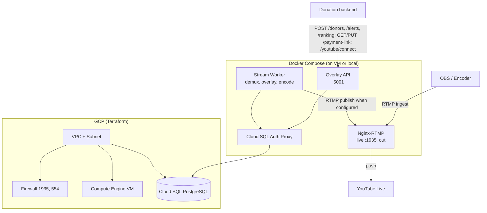
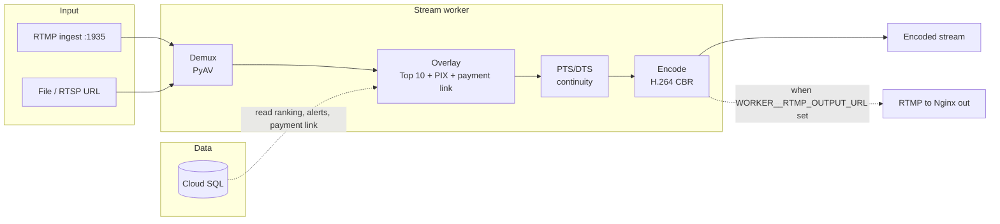
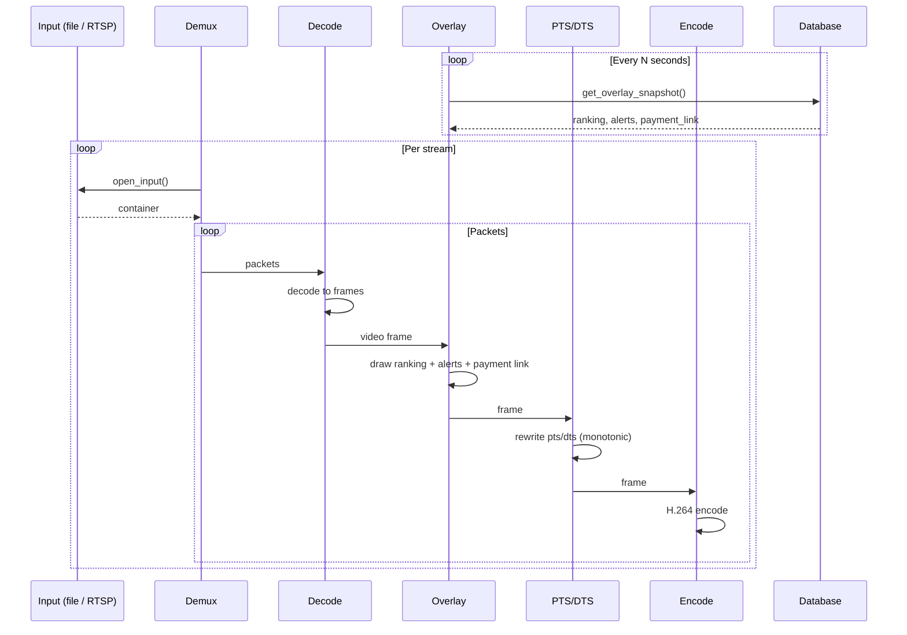
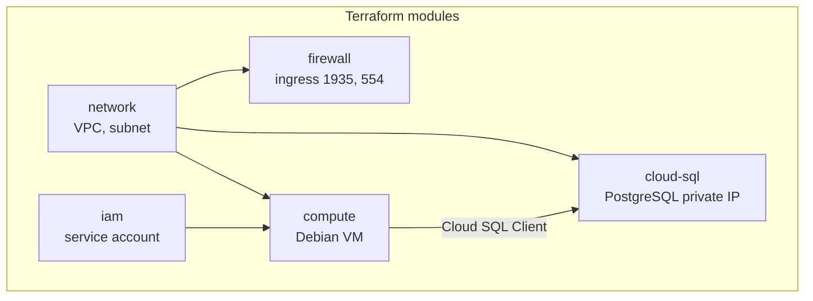
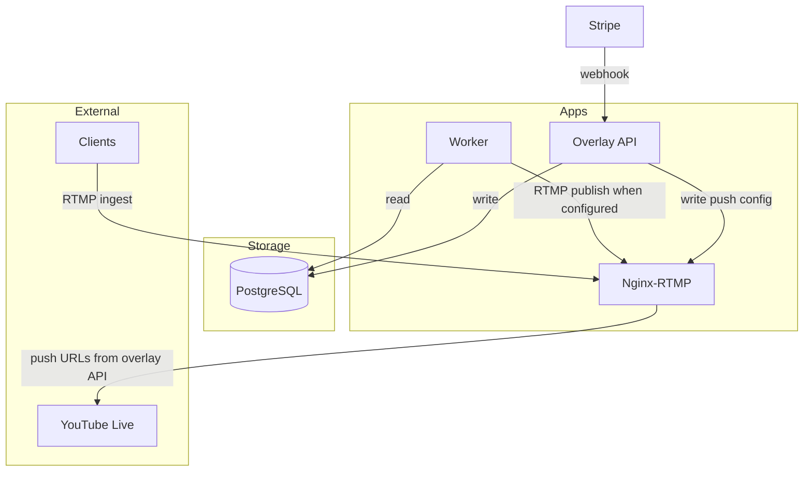

# Donatik Tube – 24/7 streaming on GCP

Live streaming pipeline for **YouTube Live**: Terraform-provisioned GCP infrastructure (Compute Engine, Cloud SQL PostgreSQL), Nginx-RTMP ingest, and Python workers for demux, overlay (Top 10 donor ranking, PIX alerts, and a **payment/donation link**), PTS/DTS continuity, and H.264 encode. The worker can publish the encoded stream to Nginx; the **overlay API** writes Nginx push config from the YouTube API and pushes the same stream to **multiple YouTube channels** (no manual stream keys). The overlay API also exposes **payment link** endpoints (GET/PUT), **YouTube OAuth** (/youtube/connect, /youtube/callback), and an optional **Stripe webhook** for payment-to-donor sync.

This guide explains everything you need to deploy the stack on Google Cloud Platform.

---

## Table of contents

1. [How it works (diagrams)](#how-it-works-diagrams)
2. [Prerequisites](#prerequisites)
3. [GCP project setup](#gcp-project-setup)
4. [Deploy infrastructure with Terraform](#deploy-infrastructure-with-terraform)
5. [Cloud SQL: create user and get connection details](#cloud-sql-create-user-and-get-connection-details)
6. [Configuration and secrets](#configuration-and-secrets)
7. [Initialize the database](#initialize-the-database)
8. [Run the stack (Docker Compose)](#run-the-stack-docker-compose)
9. [Ingest stream and push to YouTube Live](#ingest-stream-and-push-to-youtube-live)
10. [Overlay API and data](#overlay-api-and-data)
11. [YouTube Live (multiple accounts)](#youtube-live-multiple-accounts)
12. [Architecture summary](#architecture-summary)
13. [Troubleshooting](#troubleshooting)

---

## How it works (diagrams)

### System overview



Terraform provisions the network, VM, and Cloud SQL and enables the YouTube Data API (IAM module). Docker Compose runs Nginx-RTMP (application `live` for ingest, application `out` for worker RTMP and YouTube push), the stream worker, the overlay API, and optionally the Cloud SQL Auth Proxy. The worker reads overlay data from the DB (via the proxy or private IP) and, when `WORKER__RTMP_OUTPUT_URL` is set, publishes the encoded stream to Nginx `out`. The overlay API writes push URLs to Nginx from the YouTube API and Nginx pushes to one or more YouTube channels. The overlay API also serves the global payment link (GET/PUT `/payment-link`), YouTube OAuth (`/youtube/connect`, `/youtube/callback`), and Stripe webhook (POST `/stripe-webhook`).

### Stream and data flow



Input is a file or RTSP URL (or RTMP if the worker is configured to read from Nginx). The worker demuxes, applies overlay data (ranking, alerts, and one global payment link) from the DB, rewrites timestamps for continuity, and encodes to H.264. When `WORKER__RTMP_OUTPUT_URL` is set, the encoded stream is also published to that RTMP URL (typically Nginx application `out`); Nginx then pushes to YouTube using URLs written by the overlay API. The overlay API writes donors, alerts, ranking, and the payment link into the same DB and exposes GET/PUT `/payment-link`, YouTube OAuth, and POST `/stripe-webhook`.

### Worker pipeline (detail)



The worker opens the input (file or RTSP), demuxes packets, decodes to frames, draws the overlay (ranking, alerts, and payment link when configured) from the latest DB snapshot, rewrites PTS/DTS for smooth playback, and encodes to H.264. Overlay data is refreshed periodically from the database.

### Infrastructure (Terraform)



Terraform creates the VPC and subnet, firewall rules for RTMP (1935) and RTSP (554), a private-IP-only Cloud SQL instance, a Compute Engine VM, and an IAM service account so the VM can connect to Cloud SQL.

### Component summary



| Component     | Role |
|---------------|------|
| **Nginx-RTMP** | Application `live`: RTMP ingest on port 1935. Application `out`: receives worker RTMP publish and pushes to multiple YouTube URLs (push directives written by overlay API to `youtube_push.conf`). |
| **Worker**     | Reads video from file/RTSP (or RTMP), applies overlay (ranking, alerts, payment link) from DB, keeps PTS/DTS continuous, encodes to H.264. When `WORKER__RTMP_OUTPUT_URL` is set, publishes encoded stream to Nginx `out`. |
| **Overlay API**| REST API: writes donors, ranking, PIX alerts, payment link; GET/PUT `/payment-link` (optional API key); GET `/youtube/connect`, `/youtube/callback` (OAuth); background refresh of YouTube ingestion URLs and Nginx push config; POST `/stripe-webhook`. |
| **PostgreSQL** | Stores overlay data (donors, ranking, alerts, overlay_payment_link); read by workers, written by the overlay API. |

---

## Prerequisites

- **GCP account** with billing enabled.
- **gcloud CLI** installed and authenticated: `gcloud auth login` and `gcloud config set project YOUR_PROJECT_ID`.
- **Terraform** ≥ 1.x ([install](https://developer.hashicorp.com/terraform/downloads)).
- **Docker** and **Docker Compose** (for running Nginx-RTMP, workers, and Cloud SQL Auth Proxy).
- **Python 3.11+** and **uv** (optional, for local runs and `scripts/init_db.py`).

---

## GCP project setup

1. Create or select a GCP project and note the **project ID**.

2. Enable required APIs:

   ```bash
   gcloud services enable compute.googleapis.com
   gcloud services enable sqladmin.googleapis.com
   gcloud services enable iam.googleapis.com
   ```

   The Terraform IAM module also enables `youtube.googleapis.com` (YouTube Data API) when you apply; you can enable it manually if you use the API before applying Terraform.

3. Ensure billing is linked to the project (required for Compute Engine and Cloud SQL).

---

## Deploy infrastructure with Terraform

Terraform creates:

- **VPC** and subnet (ingress allowed only on ports **1935** RTMP and **554** RTSP).
- **Cloud SQL PostgreSQL** with private IP only (no public IP).
- **Compute Engine VM** (Debian 12) with a service account that has Cloud SQL Client and Logging.
- **IAM** service account for the VM.

Steps:

1. Go to the prod environment:

   ```bash
   cd terraform/environments/prod
   ```

2. Copy the example tfvars and set your project ID (and optionally region/zone):

   ```bash
   cp terraform.tfvars.example terraform.tfvars
   # Edit terraform.tfvars:
   #   project_id = "your-gcp-project-id"
   #   region     = "us-central1"   # optional
   #   zone       = "us-central1-a" # optional
   ```

3. Initialize and apply:

   ```bash
   terraform init
   terraform plan -var-file=terraform.tfvars
   terraform apply -var-file=terraform.tfvars
   ```

4. Save the outputs; you will need the Cloud SQL connection name and (optionally) the VM private IP:

   ```bash
   terraform output cloud_sql_connection_name   # e.g. project-id:region:streaming-db
   terraform output compute_network_ip         # private IP of the VM
   ```

The state file is stored locally in `terraform/environments/prod/terraform.tfstate`. For production, consider a remote backend (GCS + state locking).

---

## Cloud SQL: create user and get connection details

The Cloud SQL instance has **private IP only**. To connect you either:

- Run the **Cloud SQL Auth Proxy** (recommended for local or Docker), or
- Connect from the **VM** in the same VPC using the instance **private IP**.

1. Create a database user and set a password (if not already done). You can use the GCP Console (Cloud SQL → Users) or `gcloud sql users create`:

   ```bash
   gcloud sql users create YOUR_DB_USER \
     --instance=streaming-db \
     --password=YOUR_SECURE_PASSWORD
   ```

   The database name created by Terraform is `donate` (or the value of `db_name` in the Cloud SQL module).

2. **Connection name** (for Auth Proxy): use the Terraform output:

   - `terraform output cloud_sql_connection_name` → value like `your-project:us-central1:streaming-db`.

3. **Private IP** (for connections from the VM): use Terraform output from the Cloud SQL module, or:

   - GCP Console → Cloud SQL → your instance → **Private IP**.

---

## Configuration and secrets

All application settings are centralized in **Pydantic Settings** (`src/config/settings.py`). Environment variables use the form **`SECTION__key`** (double underscore). A `.env` file in the project root is loaded automatically.

### For Docker Compose (recommended for deployment)

Create a `.env` file in the **`docker/`** directory (or where you run `docker compose`). The Compose file uses `env_file: .env` for the worker, overlay-api, and Cloud SQL Auth Proxy.

Required for the **Cloud SQL Auth Proxy** (used by Compose):

```bash
# docker/.env
CLOUD_SQL_CONNECTION_NAME=your-project:region:streaming-db
```

Required for the **app** (database and API):

```bash
# Database (app reads DB__* with Pydantic Settings)
DB__host=cloud-sql-auth
DB__port=5432
DB__name=donate
DB__user=YOUR_DB_USER
DB__password=YOUR_SECURE_PASSWORD

# Overlay API (optional; defaults are 0.0.0.0 and 5001)
API__host=0.0.0.0
API__port=5001
# Optional: require Bearer or X-API-Key for GET/PUT /payment-link
# API__payment_link_api_key=your-secret-key

# Optional: Stripe webhook secret for POST /stripe-webhook (payment-to-donor sync)
# STRIPE__webhook_secret=whsec_...
```

- **`DB__host=cloud-sql-auth`** is the Docker Compose service name of the Cloud SQL Proxy; the worker and overlay API connect to it on port 5432.

If you run the stack **on the GCP VM** and use the Cloud SQL **private IP** instead of the proxy, set:

```bash
DB__host=<Cloud SQL private IP>
DB__port=5432
DB__name=donate
DB__user=...
DB__password=...
```

and do **not** start the `cloud-sql-auth` service (or use a separate compose override).

### Full list of optional env vars

See **`.env.example`** at the repo root for all supported keys (`DB__*`, `API__*`, `ENCODING__*`, `WORKER__*`, `YOUTUBE__*`, `STRIPE__*`).

---

## Initialize the database

Create the schema (tables for donors, ranking, PIX alerts, overlay_payment_link) once before running the app.

**Option A – Local with Auth Proxy**

1. Start only the Cloud SQL Proxy (e.g. in `docker/` with the same `.env`):

   ```bash
   docker compose up -d cloud-sql-auth
   ```

2. From the repo root, with `DB__*` set (e.g. in a `.env` in the repo root or exported), run:

   ```bash
   uv run python scripts/init_db.py
   ```

   If `DB__user` is empty, the app uses SQLite (`overlay.db`) and no proxy is needed.

**Option B – On the VM**

1. Copy your `.env` (with `DB__*` and, if using proxy, `CLOUD_SQL_CONNECTION_NAME`) to the VM.
2. Run the proxy (if used) and then:

   ```bash
   uv run python scripts/init_db.py
   ```

   Or run `init_db.py` inside a worker container that shares the same network as the proxy.

---

## Run the stack (Docker Compose)

From the **`docker/`** directory (with the same `.env` that has `CLOUD_SQL_CONNECTION_NAME` and `DB__*`):

```bash
cd docker
docker compose up -d
```

This starts:

- **nginx-rtmp** – RTMP ingest on port **1935** (application `live`); application `out` for worker RTMP and YouTube push (see [YouTube Live](#youtube-live-multiple-accounts)).
- **overlay-api** – Overlay data API (donors, alerts, ranking, payment link, Stripe webhook, YouTube OAuth and push-config refresh) on port **5001**.
- **worker** – Python stream worker (demux, overlay, encode); reads overlay data from the DB; optional RTMP output to Nginx when `WORKER__RTMP_OUTPUT_URL` is set.
- **cloud-sql-auth** – Cloud SQL Auth Proxy; worker and overlay API use it when `DB__host=cloud-sql-auth`.

**Note:** The Compose file uses the image `tiangolo/nginx-rtmp` for Nginx-RTMP (no custom build by default).

To run **on the GCP VM**:

1. Install Docker and Docker Compose on the VM (e.g. via startup script or manually).
2. Clone the repo and copy `docker/.env` (and optionally adjust `DB__host` to the Cloud SQL private IP and omit the proxy).
3. Run `docker compose up -d` from `docker/`.

---

## Ingest stream and push to YouTube Live

- **Worker input:** The worker reads from a file or RTSP URL (`WORKER__default_input_url`). For OBS or another encoder, you can point the worker at an RTMP URL if supported, or use an intermediate RTSP/RTMP server that the worker pulls from.

- **YouTube Live (recommended – multiple accounts):** Use the [YouTube Live (multiple accounts)](#youtube-live-multiple-accounts) flow: set `WORKER__RTMP_OUTPUT_URL`, configure YouTube OAuth and refresh tokens, and let the overlay API write Nginx push URLs from the YouTube API. Nginx application `out` receives the worker stream and pushes to all configured channels.

- **YouTube Live (single channel, manual):** To push only the `live` ingest (e.g. from OBS) to one YouTube stream key, add a `push rtmp://a.rtmp.youtube.com/live2/<stream_key>;` inside the `live` application in `docker/nginx/nginx.conf` and restart Nginx. Ingest is at `rtmp://<host>:1935/live/<stream_key>`; `<host>` is the VM’s public IP or your host when running Compose locally.

---

## Overlay API and data

- **Read:** Workers read the Top 10 ranking, PIX alerts, and the global payment link from the database (atomic snapshot) every few seconds; if the DB is unreachable, they keep the last known overlay.
- **Write:** The **overlay API** writes donors, alerts, ranking, and the payment link to the same database. It is included in Docker Compose (service `overlay-api`). For local runs:

  ```bash
  uv run overlay-api
  ```

  Default bind: `0.0.0.0:5001`. Set `API__host` and `API__port` via env if needed.

- **Endpoints:**  
  - `POST /donors`, `POST /alerts`, `POST /ranking` – feed overlay data from your donation/alert backend (see `src/overlay_api/app.py`).  
  - **GET/PUT `/payment-link`** – read/update the single global payment link (URL + label) shown on the overlay. When `API__payment_link_api_key` is set, requests must send `Authorization: Bearer <key>` or `X-API-Key: <key>`.  
  - **POST `/stripe-webhook`** – Stripe webhook for payment-to-donor sync. When `STRIPE__webhook_secret` is set, the API verifies the signature and creates donors on `checkout.session.completed`.

- **Payment link on overlay:** One global payment/donation link (URL + label) is stored in `overlay_payment_link` and drawn on the overlay when set; when empty, no payment link area is shown. For setup (Stripe payment links, webhook, API key), see **`specs/1-stripe-payment-links/quickstart.md`**.

---

## YouTube Live (multiple accounts)

The same overlay-encoded stream can be pushed to **multiple YouTube channels**. No manual stream keys: credentials live in `.env`; the overlay API gets ingestion URLs from the YouTube API and writes Nginx push config.

1. **Terraform:** The IAM module enables the YouTube Data API (`youtube.googleapis.com`) in the project. Apply Terraform as usual.
2. **OAuth client (one-time):** In GCP Console → APIs & Services → Credentials, create an OAuth 2.0 client ID (e.g. Web application). Set `YOUTUBE__CLIENT_ID` and `YOUTUBE__CLIENT_SECRET` in your `.env`.
3. **Connect each channel (one-time per channel):** Open `GET /youtube/connect` (e.g. `http://<api-host>:5001/youtube/connect`). Optionally protect with `API__payment_link_api_key`. After signing in with the YouTube channel’s Google account, the callback page shows a **refresh token**. Add it to `YOUTUBE__REFRESH_TOKENS` in `.env` as JSON, e.g. `YOUTUBE__REFRESH_TOKENS={"UCxxxx":"1//0abc..."}`. Merge with existing channels if needed. Restart the overlay API.
4. **Worker RTMP output:** Set `WORKER__RTMP_OUTPUT_URL=rtmp://nginx-rtmp:1935/out/stream` (or your Nginx host/port) so the worker publishes the encoded stream to the Nginx `out` application.
5. **Overlay API** runs a background loop that refreshes access tokens, calls the YouTube Live Streaming API to create or reuse streams and broadcasts, writes `push rtmp://...;` lines to the Nginx include file, and reloads Nginx. No manual nginx or stream key edits.

With Docker Compose, the overlay-api service mounts the same `nginx/conf.d` volume as Nginx so it can write the push file. Ensure `YOUTUBE__PUSH_CONF_PATH` matches the path inside the container (default `/etc/nginx/conf.d/youtube_push.conf`).

---

## Encoding (YouTube Live)

- CBR 4500 kbps, GOP 2 s, H.264 high profile, level 4.1, tune zerolatency.
- Configured in **`src/config/settings.py`** (EncodingSettings). Override via env (e.g. `ENCODING__cbr_bitrate_k`, `ENCODING__encoder`) or `.env`.

---

## Architecture summary

See the [How it works (diagrams)](#how-it-works-diagrams) section for Mermaid diagrams (system overview, stream flow, worker pipeline, Terraform, and component summary).

| Component        | Purpose |
|-----------------|---------|
| **Terraform**   | VPC, firewall (1935, 554), Cloud SQL (PostgreSQL, private IP), Compute Engine VM, IAM; IAM module enables YouTube Data API. |
| **Nginx-RTMP**  | Application `live`: RTMP ingest on 1935. Application `out`: worker RTMP input and push to YouTube (push config from overlay API). |
| **Worker**      | Demux → overlay (DB) → PTS/DTS → H.264 encode; optional RTMP publish to Nginx `out` when `WORKER__RTMP_OUTPUT_URL` is set. |
| **Cloud SQL**   | Stores donors, ranking, PIX alerts, overlay_payment_link; read by workers, written by overlay API. |
| **Auth Proxy**  | Allows secure connection to Cloud SQL from Docker or local (no direct public IP on DB). |

---

## Troubleshooting

- **Worker can’t connect to DB:** Ensure `DB__host` and `DB__port` point to the Auth Proxy service (`cloud-sql-auth`) or to the Cloud SQL private IP if not using the proxy. Check that the proxy container is running and `CLOUD_SQL_CONNECTION_NAME` is correct.
- **Terraform apply fails (e.g. API not enabled):** Run the `gcloud services enable` commands from [GCP project setup](#gcp-project-setup).
- **VM has no external IP:** The Compute instance includes `access_config {}`, so it gets an ephemeral external IP. If you use a different Terraform setup without it, you won’t be able to reach RTMP from the internet unless you use a load balancer or another path.
- **Firewall:** Only ports 1935 and 554 are open for ingress; overlay API (5001) and SSH (22) are not in the Terraform firewall. Add rules or use IAP if you need to reach the VM for SSH or the API.
- **YouTube push not updating:** Ensure overlay-api has write access to the same `nginx/conf.d` path as Nginx (volume mount in Compose) and that `YOUTUBE__PUSH_CONF_PATH` matches. Check that `YOUTUBE__REFRESH_TOKENS` is valid JSON and that the overlay API log shows the YouTube refresh thread started.
- **Worker not pushing to RTMP:** Ensure `WORKER__RTMP_OUTPUT_URL` is set (e.g. `rtmp://nginx-rtmp:1935/out/stream`) and that the worker container can reach the Nginx host; ensure ffmpeg is installed in the worker image.

---

## Repo layout

- **`terraform/`** – GCP modules (network, compute, cloud-sql, iam with YouTube API) and prod environment.
- **`docker/`** – Docker Compose (nginx-rtmp, overlay-api, worker, cloud-sql-auth), Nginx config and `conf.d` for YouTube push, Dockerfile for worker.
- **`src/stream_workers/`** – Demux, overlay, PTS/DTS, encode, RTMP output, DB read.
- **`src/overlay_api/`** – Internal API for overlay data writes, YouTube OAuth and push refresh.
- **`src/config/`** – Centralized Pydantic Settings (DB, encoding, API, worker).
- **`scripts/init_db.py`** – Creates the database schema.
